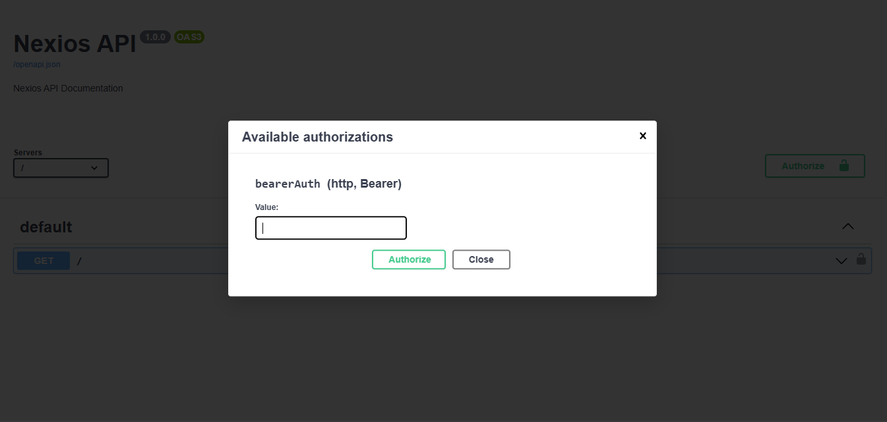

# OpenAPI Authentication in Nexios

Securing your API is essential for protecting user data and enabling safe integrations. Nexios supports multiple authentication schemes and provides first-class OpenAPI documentation for each.

---

## 1. Why Secure Your API?

APIs without authentication are vulnerable to abuse and data leaks. Always protect sensitive endpoints!

**Example:**

```python
@app.get("/public")
async def public_info(req, res):
    return {"info": "Anyone can see this."}

@app.get("/private", security=[{"bearerAuth": []}])
async def private_info(req, res):
    return {"info": "Only authenticated users see this."}
```

---

## 2. Bearer (JWT) Authentication

JWT (JSON Web Token) is the default method. Nexios includes a `bearerAuth` scheme automatically.

### How to Require JWT Auth

```python
from nexios import NexiosApp

app = NexiosApp()

@app.get("/profile", security=[{"bearerAuth": []}], summary="Get user profile (JWT required)")
async def get_profile(req, res):
    # req.user is set after authentication
    ...
```

**What does this look like in docs?**


### Multiple JWT-Protected Endpoints

```python
@app.get("/settings", security=[{"bearerAuth": []}])
async def settings(req, res): ...

@app.post("/posts", security=[{"bearerAuth": []}])
async def create_post(req, res): ...
```

### Customizing Bearer Scheme

```python
from nexios.openapi.models import HTTPBearer
app.docs.add_security_scheme(
    "jwtAuth",
    HTTPBearer(
        type="http",
        scheme="bearer",
        bearerFormat="JWT",
        description="JWT token required in Authorization header"
    )
)
```

---

## 3. API Key Authentication (Header, Query, Cookie)

API keys are great for simple, programmatic access. You must register the scheme first.

### Register an API Key Scheme

```python
from nexios.openapi.models import APIKey
app.docs.add_security_scheme(
    "apiKeyAuth",
    APIKey(
        name="X-API-KEY",
        **{"in": "header", "description": "Your API access key", "type": "apiKey"}
    )
)
```

### Require API Key on an Endpoint

```python
@app.get("/admin", security=[{"apiKeyAuth": []}], summary="Admin access (API Key)")
async def admin_panel(req, res):
    ...
```

### Use API Key in Query or Cookie

```python
APIKey(
    name="api_key",
    **{"in": "query", "description": "API key as query parameter", "type": "apiKey"}
)
APIKey(
    name="session_id",
    **{"in": "cookie", "description": "Session cookie", "type": "apiKey"}
)
```

---

## 4. OAuth2 Authentication (with Scopes)

OAuth2 is for delegated, third-party access. Nexios supports all flows.

### Register OAuth2 Password Flow

```python
from nexios.openapi.models import OAuth2, OAuthFlows, OAuthFlowPassword
app.docs.add_security_scheme(
    "oauth2",
    OAuth2(
        flows=OAuthFlows(
            password=OAuthFlowPassword(
                tokenUrl="/auth/token",
                scopes={
                    "read": "Read access",
                    "write": "Write access",
                    "admin": "Admin privileges"
                }
            )
        ),
        description="OAuth2 password flow authentication"
    )
)
```

### Require OAuth2 with Scopes

```python
@app.get("/admin", security=[{"oauth2": ["admin"]}], summary="Admin-only endpoint")
async def admin_dashboard(req, res):
    ...
```

---

## 5. Combining Security Schemes

You can require multiple or alternative auth methods.

**Example: JWT _or_ API Key**

```python
@app.get("/superuser", security=[{"bearerAuth": []}, {"apiKeyAuth": []}])
async def superuser_panel(req, res):
    ...
```

---

## 6. Best Practices & Troubleshooting

- Register all security schemes before referencing them.
- Use clear, descriptive names for each scheme.
- Document which endpoints require which auth.
- For public APIs, prefer OAuth2 for flexibility.
- Test your docs UI to ensure all auth flows work as expected.

---

**See also:**

- [Request Parameters](./request-parameters.md)
- [Response Models](./response-models.md)
- [Customizing OpenAPI](./customizing-openapi-configuration.md)
