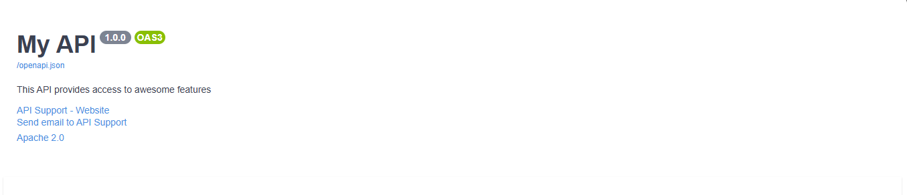

# Customizing OpenAPI Configuration in Nexios

Nexios empowers you to tailor your OpenAPI documentation to match your project's branding, technical requirements, and support needs. This guide explains how to configure everything from basic metadata to advanced custom fields, ensuring your API docs are professional and informative.

---

## Why Customize OpenAPI?

Clear, accurate, and branded documentation:

- Builds trust with API consumers
- Reduces onboarding time for developers
- Helps with compliance and support

---

## Basic Configuration: Title, Version, and Description

Set fundamental API information directly in the `NexiosApp` constructor:

```python
from nexios import NexiosApp

app = NexiosApp(
    title="My API",
    version="1.0.0",
    description="A production-grade API for managing users, orders, and analytics."
)
```

This metadata appears at the top of your OpenAPI docs and helps users quickly understand your API's purpose and versioning.

---

## Example Endpoint (With Metadata)

```python
@app.get("/status", summary="Health check", description="Returns API uptime and status.")
async def status(req, res):
    return {"status": "ok", "uptime": 12345}
```


---

## Advanced Configuration: Full OpenAPI Customization

For complete control, use `MakeConfig` and provide a full OpenAPI configuration dictionary. This is essential for large teams, enterprise APIs, or when integrating with external partners.

```python
from nexios.openapi.models import Contact, License
from nexios import MakeConfig, NexiosApp
from nexios.openapi import OpenAPIConfig

config = MakeConfig(
    openapi=OpenAPIConfig(
        title="Enterprise API",
        version="2.1.0",
        description="Comprehensive API for business operations.",
        termsOfService="https://example.com/terms",
        contact=Contact(
            name="API Team",
            url="https://example.com/support",
            email="support@example.com"
        ),
        license=License(
            name="Apache 2.0",
            url="https://www.apache.org/licenses/LICENSE-2.0.html"
        )
    )
)

app = NexiosApp(config=config)
```

---

## Visual Example

Your custom configuration will be reflected in the generated documentation, including contact and license information:



---

## Best Practices

- Always provide a meaningful description and version.
- Include contact and license information for support and legal clarity.
- Use `termsOfService` and other OpenAPI fields for enterprise or public APIs.
- Review your documentation output regularly to ensure accuracy.

For more advanced customization (security schemes, tags, etc.), see the subsequent pages in this guide.
