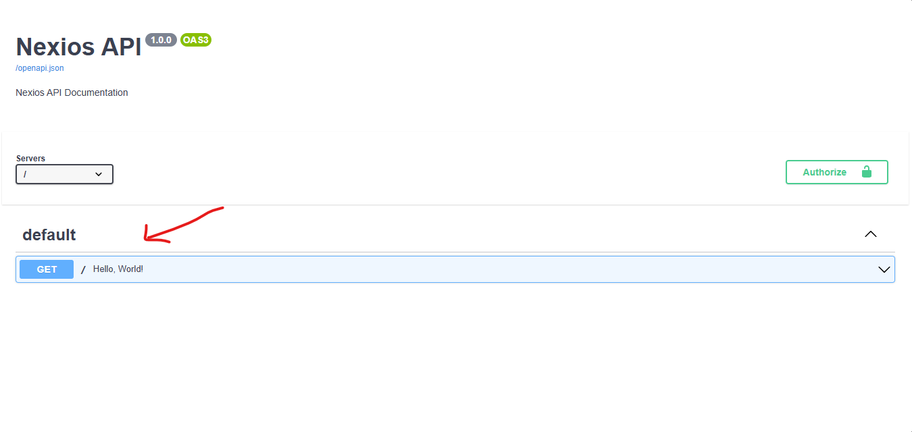

# OpenAPI Documentation in Nexios

Nexios offers robust, automatic API documentation powered by the OpenAPI standard. This enables developers, teams, and integrators to understand, explore, and test your API with confidence and clarity.

---

By default, Nexios generates a complete OpenAPI specification for all your routes. You can access the interactive documentation UI at `/docs` and download the raw OpenAPI JSON at `/openapi.json`.

This guide covers:

- How Nexios generates OpenAPI docs
- Customizing endpoint summaries and descriptions
- Best practices for writing clear, professional API docs
- Real-world examples for production APIs

---

## Automatic Documentation

Every route you define in Nexios is automatically documented. This includes:

- HTTP method and path
- Parameter types (path, query, header)
- Request and response models
- Status codes and example responses
- Authentication requirements (if configured)

You can instantly visualize and test your API using the `/docs` interface—no extra configuration required.

## Basic Example

```python
from nexios import NexiosApp
app = NexiosApp()

@app.get("/", summary="Hello World", description="A simple health check endpoint.")
async def get_root(req, res):
    """Returns a friendly greeting."""
    return {"message": "Hello World"}
```



## Enhancing Your Documentation

For professional APIs, always provide clear summaries and detailed descriptions for each endpoint. This improves developer experience and reduces support requests.

```python
@app.get(
    "/users/{user_id}",
    summary="Retrieve user details",
    description="Fetches the full profile for a user by their unique ID. Returns 404 if not found."
)
async def get_user(req, res, user_id: int):
    """Get a single user's profile information."""
    ...
```


::: tip Best Practice
Use the `summary` for a concise, one-line explanation. Use `description` to provide details, edge cases, and business rules.
:::

## Next Steps

- Add parameter and model documentation (see next pages)
- Document authentication and error responses
- Use real-world data and examples in your docs

---

For advanced customization, see [Customizing OpenAPI Configuration](./customizing-openapi-configuration.md).
